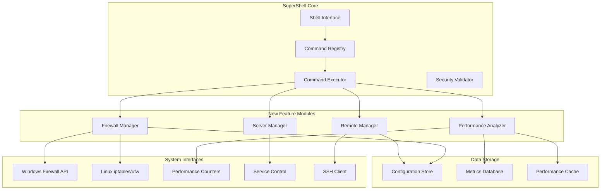

# Design Document

## Overview

This design document outlines the implementation of priority SuperShell features that will transform it into a comprehensive enterprise server management platform. The design builds upon the existing command architecture and extends it with four major feature areas: Firewall Management, Performance Analysis & Optimization, Server Management Suite, and Remote Server Management.

The design follows SuperShell's existing patterns of command registration, execution context, and result formatting while introducing new architectural components for advanced functionality like remote execution, performance monitoring, and system service management.

## Architecture

### High-Level Architecture



### Component Architecture

The design introduces four new major components that integrate with the existing SuperShell architecture:

1. **Firewall Manager**: Handles cross-platform firewall operations
2. **Performance Analyzer**: Collects and analyzes system performance metrics
3. **Server Manager**: Manages system services, users, and health monitoring
4. **Remote Manager**: Enables multi-server operations via SSH

## Components and Interfaces

### 1. Firewall Management Component

#### FirewallManager Interface
```go
type FirewallManager interface {
    GetStatus(ctx context.Context) (*FirewallStatus, error)
    ListRules(ctx context.Context) ([]*FirewallRule, error)
    AddRule(ctx context.Context, rule *FirewallRule) error
    RemoveRule(ctx context.Context, ruleID string) error
    EnableFirewall(ctx context.Context) error
    DisableFirewall(ctx context.Context) error
    BackupRules(ctx context.Context, filepath string) error
    RestoreRules(ctx context.Context, filepath string) error
}
```

#### Platform-Specific Implementations
- **WindowsFirewallManager**: Uses Windows Firewall API and netsh commands
- **LinuxFirewallManager**: Uses iptables/ufw commands and configuration files
- **UnifiedFirewallManager**: Provides cross-platform abstraction

#### Commands Structure
```
firewall/
├── status.go          # firewall status
├── rules.go           # firewall rules --list/--add/--remove
├── enable.go          # firewall enable
├── disable.go         # firewall disable
├── backup.go          # firewall backup --file
└── restore.go         # firewall restore --file
```

### 2. Performance Analysis Component

#### PerformanceAnalyzer Interface
```go
type PerformanceAnalyzer interface {
    CollectMetrics(ctx context.Context, duration time.Duration) (*PerformanceMetrics, error)
    AnalyzePerformance(ctx context.Context, metrics *PerformanceMetrics) (*AnalysisReport, error)
    GenerateReport(ctx context.Context, detailed bool) (*PerformanceReport, error)
    SaveBaseline(ctx context.Context, filepath string) error
    CompareBaseline(ctx context.Context, baselinePath string) (*ComparisonReport, error)
    GetOptimizationSuggestions(ctx context.Context) ([]*OptimizationSuggestion, error)
}
```

#### Metrics Collection
- **CPU Metrics**: Usage, load average, core utilization
- **Memory Metrics**: RAM usage, swap usage, memory pressure
- **Disk Metrics**: I/O operations, disk usage, read/write speeds
- **Network Metrics**: Bandwidth utilization, packet statistics, connection counts

#### Commands Structure
```
performance/
├── analyze.go         # perf analyze
├── monitor.go         # perf monitor --duration
├── report.go          # perf report --detailed
├── optimize.go        # perf optimize --auto
├── baseline.go        # perf baseline --save/--compare
└── history.go         # perf history --7days
```

### 3. Server Management Component

#### ServerManager Interface
```go
type ServerManager interface {
    GetHealthStatus(ctx context.Context) (*HealthStatus, error)
    ListServices(ctx context.Context) ([]*ServiceInfo, error)
    ControlService(ctx context.Context, serviceName string, action ServiceAction) error
    GetActiveUsers(ctx context.Context) ([]*UserSession, error)
    GetServiceLogs(ctx context.Context, serviceName string, tail bool) (*LogStream, error)
    ConfigureAlerts(ctx context.Context, config *AlertConfig) error
    BackupConfiguration(ctx context.Context, backupPath string) error
}
```

#### Health Monitoring
- **System Health**: CPU, memory, disk space, network connectivity
- **Service Health**: Service status, response times, error rates
- **Alert System**: Configurable thresholds, notification mechanisms

#### Commands Structure
```
server/
├── health.go          # server health
├── services.go        # server services --list
├── service.go         # server service --start/--stop
├── users.go           # server users --active
├── logs.go            # server logs --tail --service
├── alerts.go          # server alerts --configure
└── backup.go          # server backup --config
```

### 4. Remote Server Management Component

#### RemoteManager Interface
```go
type RemoteManager interface {
    AddServer(ctx context.Context, config *ServerConfig) error
    RemoveServer(ctx context.Context, serverID string) error
    ListServers(ctx context.Context) ([]*ServerInfo, error)
    ExecuteRemote(ctx context.Context, serverID string, command string) (*RemoteResult, error)
    ExecuteCluster(ctx context.Context, command string) ([]*RemoteResult, error)
    GetClusterStatus(ctx context.Context) (*ClusterStatus, error)
    SyncConfiguration(ctx context.Context, serverIDs []string) error
    MonitorCluster(ctx context.Context, realtime bool) (*ClusterMonitor, error)
}
```

#### SSH Connection Management
- **Connection Pool**: Reusable SSH connections with connection pooling
- **Authentication**: SSH key-based and password authentication
- **Security**: Host key verification, connection encryption

#### Commands Structure
```
remote/
├── add.go             # remote add --host --key
├── list.go            # remote list
├── exec.go            # remote exec --host --command
├── health.go          # remote health --all
├── cluster.go         # cluster status/exec
├── sync.go            # remote sync --config
└── monitor.go         # remote monitor --realtime
```

## Data Models

### Core Data Structures

#### FirewallRule
```go
type FirewallRule struct {
    ID          string
    Name        string
    Direction   Direction // Inbound/Outbound
    Action      Action    // Allow/Block
    Protocol    Protocol  // TCP/UDP/ICMP
    LocalPort   string
    RemotePort  string
    LocalIP     string
    RemoteIP    string
    Enabled     bool
    Created     time.Time
}
```

#### PerformanceMetrics
```go
type PerformanceMetrics struct {
    Timestamp   time.Time
    CPU         CPUMetrics
    Memory      MemoryMetrics
    Disk        DiskMetrics
    Network     NetworkMetrics
    Duration    time.Duration
}

type CPUMetrics struct {
    Usage       float64
    LoadAverage []float64
    CoreUsage   []float64
}
```

#### ServerConfig
```go
type ServerConfig struct {
    ID          string
    Name        string
    Host        string
    Port        int
    Username    string
    AuthMethod  AuthMethod
    KeyPath     string
    Password    string // Encrypted
    Tags        []string
    Created     time.Time
}
```

#### ServiceInfo
```go
type ServiceInfo struct {
    Name        string
    DisplayName string
    Status      ServiceStatus
    StartType   StartType
    PID         int
    Memory      int64
    CPU         float64
    Uptime      time.Duration
}
```

## Error Handling

### Error Types
- **FirewallError**: Firewall-specific errors (permission denied, rule conflicts)
- **PerformanceError**: Performance monitoring errors (metric collection failures)
- **ServiceError**: Service management errors (service not found, control failures)
- **RemoteError**: Remote execution errors (connection failures, authentication errors)

### Error Recovery Strategies
- **Retry Logic**: Automatic retry for transient failures
- **Fallback Methods**: Alternative approaches when primary methods fail
- **Graceful Degradation**: Partial functionality when some features are unavailable
- **User Feedback**: Clear error messages with suggested remediation steps

## Testing Strategy

### Unit Testing
- **Command Testing**: Test each command's argument parsing and execution logic
- **Manager Testing**: Test each manager's core functionality with mocked dependencies
- **Platform Testing**: Test platform-specific implementations with appropriate mocks
- **Error Handling**: Test error conditions and recovery mechanisms

### Integration Testing
- **Cross-Platform Testing**: Test on Windows, Linux, and macOS
- **Permission Testing**: Test elevated privilege requirements and handling
- **Network Testing**: Test remote operations with various network conditions
- **Performance Testing**: Test performance monitoring accuracy and overhead

### End-to-End Testing
- **Workflow Testing**: Test complete user workflows from command input to result output
- **Multi-Server Testing**: Test remote operations across multiple servers
- **Security Testing**: Test authentication, authorization, and secure communication
- **Stress Testing**: Test system behavior under high load and resource constraints

### Test Structure
```
tests/
├── unit/
│   ├── firewall/
│   ├── performance/
│   ├── server/
│   └── remote/
├── integration/
│   ├── platform/
│   ├── network/
│   └── security/
└── e2e/
    ├── workflows/
    ├── multiserver/
    └── stress/
```

## Security Considerations

### Authentication and Authorization
- **Privilege Escalation**: Secure handling of elevated privileges for system operations
- **SSH Security**: Secure SSH key management and host verification
- **Credential Storage**: Encrypted storage of sensitive authentication data
- **Access Control**: Role-based access control for different command categories

### Data Protection
- **Configuration Encryption**: Encrypt sensitive configuration data
- **Secure Communication**: TLS/SSH encryption for remote communications
- **Audit Logging**: Comprehensive logging of security-sensitive operations
- **Input Validation**: Strict validation of all user inputs and command parameters

### Platform Security
- **Windows Security**: Integration with Windows security model and UAC
- **Linux Security**: Integration with sudo and system security policies
- **Network Security**: Secure network communication and firewall integration
- **Container Security**: Support for containerized environments and security contexts

## Performance Considerations

### Optimization Strategies
- **Caching**: Cache frequently accessed data and computation results
- **Connection Pooling**: Reuse SSH connections for remote operations
- **Parallel Execution**: Execute operations in parallel where possible
- **Resource Management**: Efficient memory and CPU usage for monitoring operations

### Scalability
- **Multi-Server Support**: Efficient handling of large numbers of remote servers
- **Metric Storage**: Efficient storage and retrieval of performance metrics
- **Background Processing**: Background execution of long-running operations
- **Resource Limits**: Configurable limits to prevent resource exhaustion

### Monitoring
- **Self-Monitoring**: Monitor SuperShell's own performance impact
- **Resource Usage**: Track memory, CPU, and network usage
- **Operation Timing**: Measure and optimize command execution times
- **Error Rates**: Monitor and alert on error rates and patterns