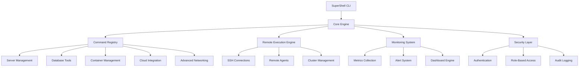

# SuperShell Server & Enterprise Enhancements - Design Document

## Overview

This design document outlines the architecture and implementation approach for transforming SuperShell into an enterprise-grade server management platform. The enhancements will be built on the existing modular architecture while adding new command categories, remote execution capabilities, and enterprise integrations.

## Architecture

### High-Level Architecture



### Component Architecture

#### 1. Server Management Module
```
internal/
├── commands/
│   └── server/
│       ├── status.go          # Server health and status
│       ├── services.go        # Service management
│       ├── users.go           # User account management
│       ├── logs.go            # Log analysis and viewing
│       ├── backup.go          # Backup management
│       ├── security.go        # Security auditing
│       └── monitor.go         # Real-time monitoring
├── server/
│   ├── health/                # Health check systems
│   ├── services/              # Service management
│   ├── backup/                # Backup systems
│   └── security/              # Security tools
```

#### 2. Remote Execution Engine
```
internal/
├── remote/
│   ├── connection/            # Connection management
│   │   ├── ssh.go            # SSH connections
│   │   ├── agent.go          # Remote agent communication
│   │   └── pool.go           # Connection pooling
│   ├── execution/             # Remote command execution
│   │   ├── executor.go       # Command execution
│   │   ├── batch.go          # Batch operations
│   │   └── streaming.go      # Real-time streaming
│   ├── cluster/               # Cluster management
│   │   ├── manager.go        # Cluster coordination
│   │   ├── discovery.go      # Node discovery
│   │   └── health.go         # Cluster health
│   └── sync/                  # File synchronization
│       ├── rsync.go          # Rsync integration
│       ├── delta.go          # Delta synchronization
│       └── conflict.go       # Conflict resolution
```

#### 3. Database Management Module
```
internal/
├── commands/
│   └── database/
│       ├── connect.go         # Database connections
│       ├── query.go           # Query execution
│       ├── backup.go          # Database backups
│       ├── restore.go         # Database restoration
│       ├── monitor.go         # Performance monitoring
│       └── migrate.go         # Schema migrations
├── database/
│   ├── drivers/               # Database drivers
│   │   ├── mysql.go          # MySQL driver
│   │   ├── postgres.go       # PostgreSQL driver
│   │   ├── mongodb.go        # MongoDB driver
│   │   └── redis.go          # Redis driver
│   ├── query/                 # Query processing
│   │   ├── parser.go         # SQL parsing
│   │   ├── formatter.go      # Result formatting
│   │   └── cache.go          # Query caching
│   └── migration/             # Migration system
│       ├── runner.go         # Migration runner
│       ├── versioning.go     # Version management
│       └── rollback.go       # Rollback capabilities
```

#### 4. Container & Orchestration Module
```
internal/
├── commands/
│   └── container/
│       ├── docker.go          # Docker management
│       ├── kubernetes.go      # Kubernetes integration
│       ├── compose.go         # Docker Compose
│       └── registry.go        # Container registry
├── container/
│   ├── docker/                # Docker integration
│   │   ├── client.go         # Docker API client
│   │   ├── images.go         # Image management
│   │   ├── containers.go     # Container lifecycle
│   │   └── networks.go       # Network management
│   ├── kubernetes/            # Kubernetes integration
│   │   ├── client.go         # K8s API client
│   │   ├── resources.go      # Resource management
│   │   ├── deployments.go    # Deployment management
│   │   └── monitoring.go     # Cluster monitoring
│   └── compose/               # Docker Compose
│       ├── parser.go         # Compose file parsing
│       ├── orchestrator.go   # Service orchestration
│       └── scaling.go        # Service scaling
```

#### 5. Cloud Integration Module
```
internal/
├── commands/
│   └── cloud/
│       ├── aws.go             # AWS integration
│       ├── azure.go           # Azure integration
│       ├── gcp.go             # Google Cloud integration
│       ├── costs.go           # Cost analysis
│       └── deploy.go          # Infrastructure deployment
├── cloud/
│   ├── providers/             # Cloud providers
│   │   ├── aws/              # AWS services
│   │   ├── azure/            # Azure services
│   │   └── gcp/              # GCP services
│   ├── iac/                   # Infrastructure as Code
│   │   ├── terraform.go      # Terraform integration
│   │   ├── cloudformation.go # CloudFormation
│   │   └── arm.go            # ARM templates
│   └── billing/               # Cost management
│       ├── analyzer.go       # Cost analysis
│       ├── optimizer.go      # Cost optimization
│       └── alerts.go         # Cost alerts
```

#### 6. Monitoring & Alerting System
```
internal/
├── monitoring/
│   ├── collectors/            # Metric collectors
│   │   ├── system.go         # System metrics
│   │   ├── application.go    # Application metrics
│   │   ├── network.go        # Network metrics
│   │   └── custom.go         # Custom metrics
│   ├── storage/               # Metric storage
│   │   ├── timeseries.go     # Time series database
│   │   ├── aggregation.go    # Data aggregation
│   │   └── retention.go      # Data retention
│   ├── alerting/              # Alert system
│   │   ├── rules.go          # Alert rules
│   │   ├── notifications.go  # Notification system
│   │   └── escalation.go     # Alert escalation
│   └── dashboard/             # Dashboard system
│       ├── renderer.go       # Dashboard rendering
│       ├── widgets.go        # Dashboard widgets
│       └── export.go         # Dashboard export
```

#### 7. Automation Engine
```
internal/
├── automation/
│   ├── scripting/             # Script engine
│   │   ├── interpreter.go    # Script interpreter
│   │   ├── variables.go      # Variable management
│   │   └── functions.go      # Built-in functions
│   ├── workflow/              # Workflow engine
│   │   ├── engine.go         # Workflow execution
│   │   ├── steps.go          # Workflow steps
│   │   └── conditions.go     # Conditional logic
│   ├── scheduler/             # Task scheduler
│   │   ├── cron.go           # Cron-like scheduling
│   │   ├── triggers.go       # Event triggers
│   │   └── queue.go          # Task queue
│   └── templates/             # Template system
│       ├── parser.go         # Template parsing
│       ├── renderer.go       # Template rendering
│       └── library.go        # Template library
```

## Components and Interfaces

### Remote Execution Interface
```go
type RemoteExecutor interface {
    Connect(host string, config ConnectionConfig) error
    Execute(command string, options ExecutionOptions) (*ExecutionResult, error)
    ExecuteBatch(commands []string, options BatchOptions) ([]*ExecutionResult, error)
    Stream(command string, handler StreamHandler) error
    Disconnect() error
}

type ConnectionConfig struct {
    Host       string
    Port       int
    Username   string
    AuthMethod AuthMethod
    Timeout    time.Duration
}

type ExecutionResult struct {
    Output    string
    Error     string
    ExitCode  int
    Duration  time.Duration
    Host      string
}
```

### Monitoring Interface
```go
type MonitoringSystem interface {
    StartMonitoring(targets []string, config MonitoringConfig) error
    StopMonitoring(targets []string) error
    GetMetrics(query MetricQuery) (*MetricResult, error)
    SetAlert(rule AlertRule) error
    GetAlerts(filter AlertFilter) ([]*Alert, error)
}

type MetricQuery struct {
    Metric    string
    TimeRange TimeRange
    Filters   map[string]string
    Aggregation string
}

type Alert struct {
    ID          string
    Rule        string
    Severity    AlertSeverity
    Message     string
    Timestamp   time.Time
    Resolved    bool
}
```

### Database Interface
```go
type DatabaseManager interface {
    Connect(config DatabaseConfig) error
    Query(sql string, params ...interface{}) (*QueryResult, error)
    Execute(sql string, params ...interface{}) (*ExecutionResult, error)
    Backup(options BackupOptions) error
    Restore(backupPath string, options RestoreOptions) error
    GetSchema() (*Schema, error)
}

type DatabaseConfig struct {
    Type     DatabaseType
    Host     string
    Port     int
    Database string
    Username string
    Password string
    Options  map[string]string
}
```

## Data Models

### Server Information Model
```go
type ServerInfo struct {
    Hostname     string
    OS           OperatingSystem
    Architecture string
    CPUs         int
    Memory       MemoryInfo
    Disk         []DiskInfo
    Network      []NetworkInterface
    Services     []ServiceInfo
    Uptime       time.Duration
    LoadAverage  []float64
}

type ServiceInfo struct {
    Name        string
    Status      ServiceStatus
    PID         int
    StartTime   time.Time
    Memory      int64
    CPU         float64
    Description string
}
```

### Monitoring Data Model
```go
type MetricPoint struct {
    Timestamp time.Time
    Value     float64
    Labels    map[string]string
}

type MetricSeries struct {
    Name   string
    Points []MetricPoint
    Unit   string
}

type Dashboard struct {
    ID          string
    Name        string
    Description string
    Widgets     []Widget
    Layout      Layout
    Filters     []Filter
}
```

### Automation Models
```go
type Script struct {
    ID          string
    Name        string
    Description string
    Language    ScriptLanguage
    Content     string
    Parameters  []Parameter
    Schedule    *Schedule
    Tags        []string
}

type Workflow struct {
    ID          string
    Name        string
    Description string
    Steps       []WorkflowStep
    Triggers    []Trigger
    Variables   map[string]interface{}
}

type WorkflowStep struct {
    ID          string
    Name        string
    Type        StepType
    Command     string
    Conditions  []Condition
    OnSuccess   string
    OnFailure   string
    Timeout     time.Duration
}
```

## Error Handling

### Error Categories
1. **Connection Errors** - Remote connection failures
2. **Authentication Errors** - Authentication and authorization failures
3. **Execution Errors** - Command execution failures
4. **Resource Errors** - Resource availability issues
5. **Configuration Errors** - Configuration validation failures
6. **Network Errors** - Network connectivity issues

### Error Recovery Strategies
1. **Retry Logic** - Automatic retry with exponential backoff
2. **Fallback Mechanisms** - Alternative execution paths
3. **Circuit Breakers** - Prevent cascading failures
4. **Graceful Degradation** - Reduced functionality when services are unavailable

## Testing Strategy

### Unit Testing
- Command execution logic
- Data model validation
- Error handling scenarios
- Configuration parsing

### Integration Testing
- Database connectivity
- Remote execution
- Cloud provider APIs
- Container orchestration

### End-to-End Testing
- Complete workflow execution
- Multi-server operations
- Monitoring and alerting
- Security and compliance

### Performance Testing
- Large-scale operations
- Concurrent connections
- Memory and CPU usage
- Network bandwidth utilization

## Security Considerations

### Authentication & Authorization
- Multi-factor authentication
- Role-based access control
- API key management
- Session management

### Data Protection
- Encryption at rest and in transit
- Secure credential storage
- Audit logging
- Data anonymization

### Network Security
- TLS/SSL encryption
- VPN integration
- Firewall management
- Network segmentation

### Compliance
- SOC 2 compliance
- GDPR compliance
- HIPAA compliance
- Industry-specific standards